# Practicum Jobsheet: Meeting 11
## SOLID Principles

| | |
|---|---|
| **Course** | Object-Oriented Programming (RTI253007) |
| **Meeting** | 11 (Week 11) |
| **Duration** | 1 &times; 2 &times; 50' face-to-face; 1 &times; 2 &times; 50' independent assignment/practice |
| **Sub-CPMK** | SCPMK0704-02502: implement OOP concepts using Java across various paradigms |
| **Starting Code** | the Maven project `pertemuan-11-starter` (provided by the instructor) |
| **Final Code** | your copy of `pertemuan-11-starter`, fully refactored |

## A. Practicum Outcomes

After completing this jobsheet, you will be able to:

1. Identify SOLID principle violations in already-working code (code smells).
2. Refactor a class by applying SRP, OCP, LSP, ISP, and DIP using interfaces and constructor injection.
3. Explain the reasoning behind each refactoring step, and prove that the program's behavior hasn't changed.

## B. Preparation and Prerequisites

- **Tools**: JDK 17 or newer, Maven, NetBeans (the editor we use, with native Maven project support).
- **Starting code**: get the `pertemuan-11-starter` project folder from your instructor and copy it to your computer. Inside it, there's an `OrderProcessor` class that actually runs correctly, it's just that every single responsibility has been jammed into one class (this is called a **code smell**, specifically a **God Class**). Your job throughout this jobsheet is to transform this project, step by step, until its design follows all five SOLID principles.
- **Quick check**: open the project folder in NetBeans (File > Open Project, NetBeans will detect the `pom.xml` right away), then Run Project. Make sure the program runs without errors before you start changing anything.

> **Without NetBeans?** Run the project from the terminal, from inside the project folder:
> ```bash
> mvn -q compile exec:java
> ```
> To run a class other than `Main` (needed in Step 6 for `ShippingDemo`):
> ```bash
> mvn -q compile exec:java -Dexec.mainClass=id.ac.polinema.ShippingDemo
> ```
> The checkpoints and output are exactly the same no matter which editor you use.

## C. Work Steps

### Step 1: Run the starting code, spot the "smell"

Look at the diagram below: the `OrderProcessor` class in the `pertemuan-11-starter` project is just one class, but it's carrying four completely different responsibilities at once.

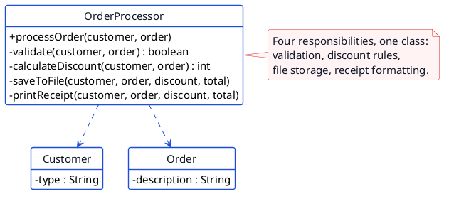{width=60%}

Here's what the four classes look like:

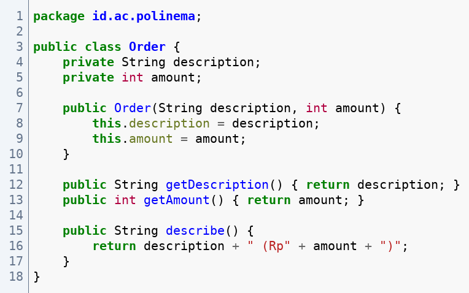{width=55%}

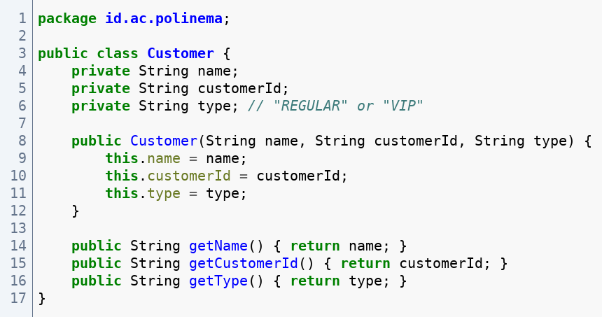{width=55%}

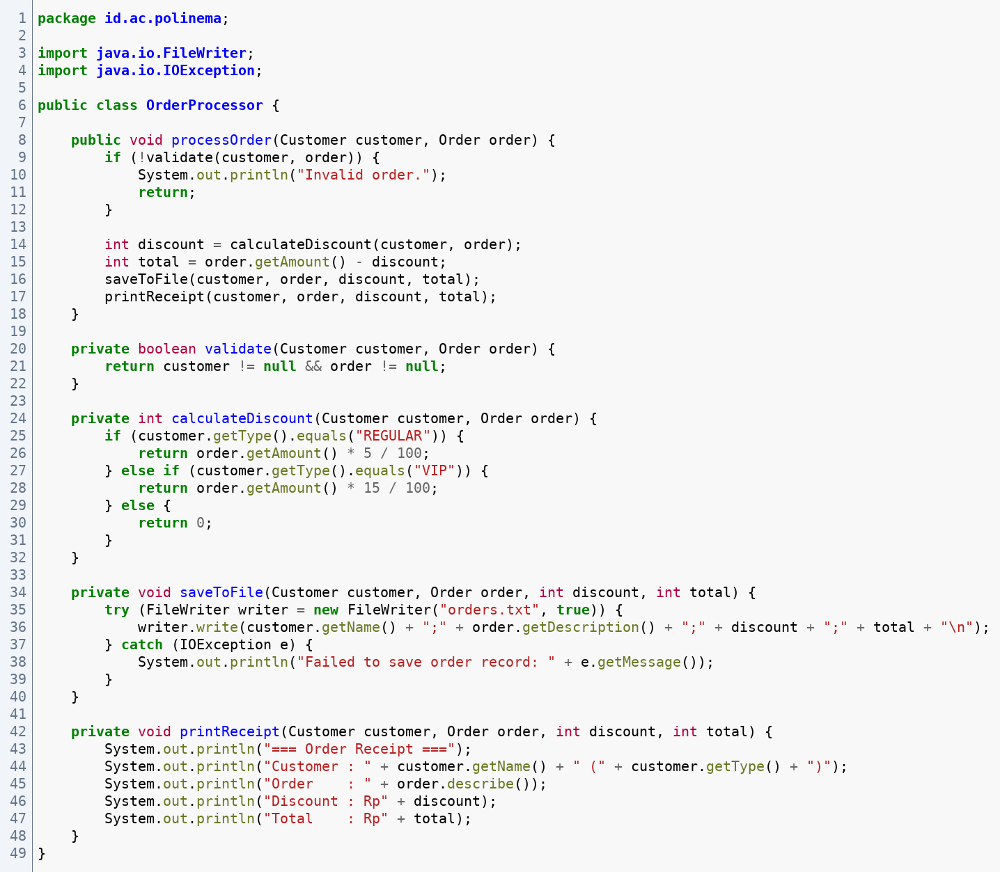{width=80%}

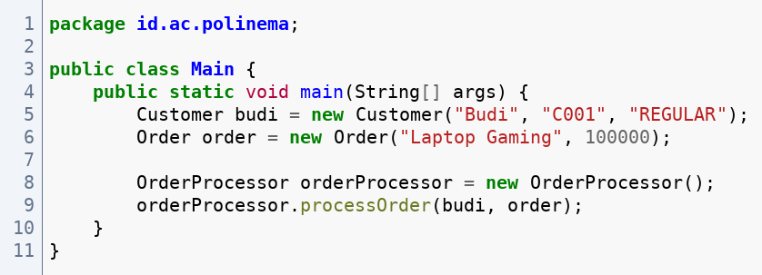{width=55%}

Run the project (Run Project in NetBeans, or `mvn -q compile exec:java`).

> ✅ **Checkpoint:** the program prints an order receipt with `Discount : Rp5000` and `Total    : Rp95000`, and there's a new file `orders.txt` in the project root holding one line of data.

Before you move on, jot this down in a comment or a separate note: how many different responsibilities do you think `OrderProcessor` is carrying right now? (Hint: count how many private methods it has, there should be at least 4.)

### Step 2: SRP, extract `DiscountCalculator`

One telltale sign of a **Single Responsibility Principle (SRP)** violation: a class has more than one "reason to change". Think about it, `OrderProcessor` changes when the discount rules change, but also when the storage method changes, and also when the receipt format changes. Three different reasons, all piled into one class. Let's split them apart one at a time, starting with the discount calculation.

Create a new class `DiscountCalculator`:

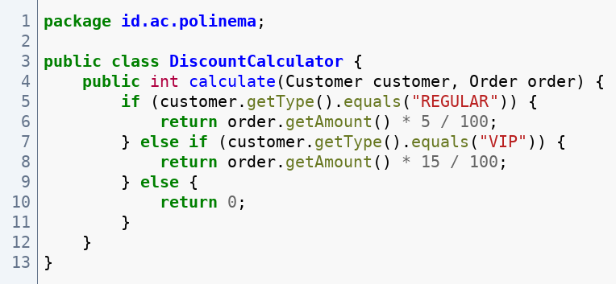{width=55%}

Update `OrderProcessor.java` (green lines mark the changed/added code):

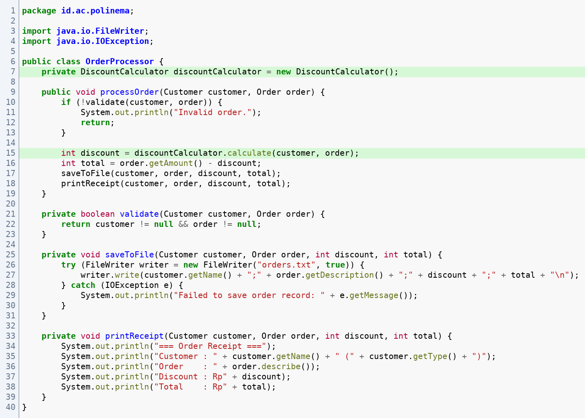{width=80%}

`Main.java` doesn't need to change at all.

> ✅ **Checkpoint:** recompile, run it again, and the output must be **exactly identical** to Step 1 (`Discount : Rp5000`, `Total    : Rp95000`). Remember, refactoring means the code's structure changes, but the program's behavior must not change at all.

### Step 3: More SRP, extract `OrderRepository` and `ReceiptPrinter`

Do the same thing for the other two responsibilities: saving data and printing the receipt.

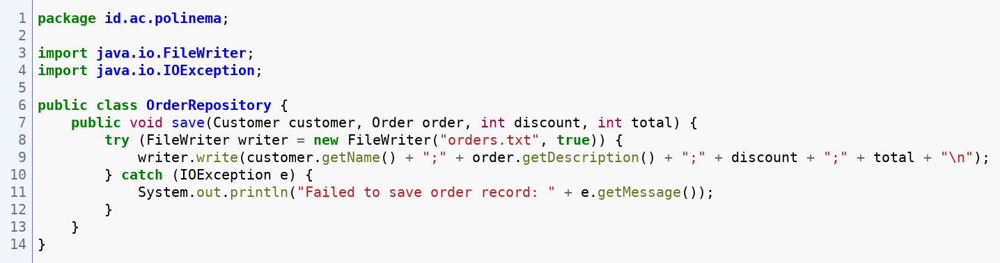{width=55%}

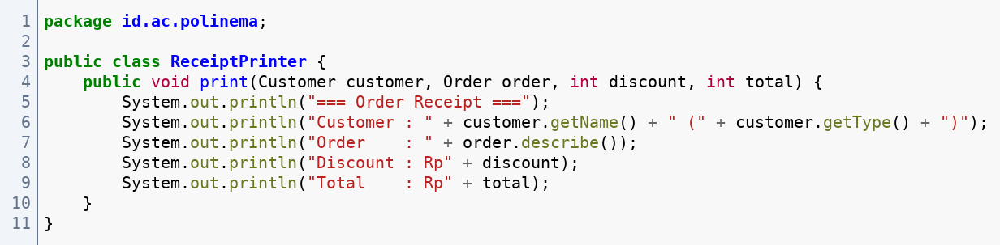{width=55%}

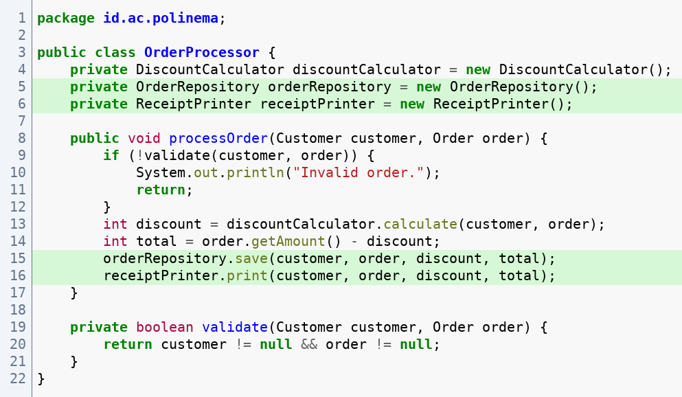{width=80%}

{width=70%}

> ✅ **Checkpoint:** the output stays identical. `OrderProcessor` now just orchestrates (calls the three other collaborators) plus one small validation check. Compare, how many lines of code does `OrderProcessor` have now versus Step 1?

> ⚠️ **If it fails:** if `cannot find symbol` shows up for `discountCalculator`/`orderRepository`/`receiptPrinter`, check that all three fields are declared exactly as shown above, BEFORE the `processOrder` method.

### Step 4: OCP, replace the if-else with `DiscountPolicy`

The **Open/Closed Principle (OCP)** says a class should be open for extension, but closed for modification. Here's the problem with `DiscountCalculator` right now: every time there's a new customer type, you have to reopen the `calculate` method and bolt on another `else if` branch. Let's swap that for a strategy (an interface) that can be registered from the outside, so you never have to touch the old code again.

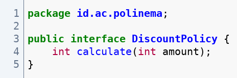{width=45%}

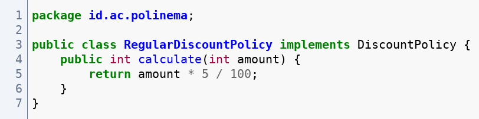{width=45%}

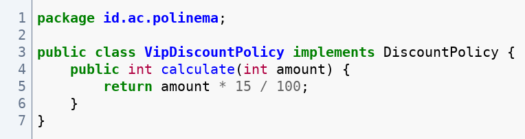{width=45%}

Update `DiscountCalculator.java` to use a `DiscountPolicy` registry instead of if-else:

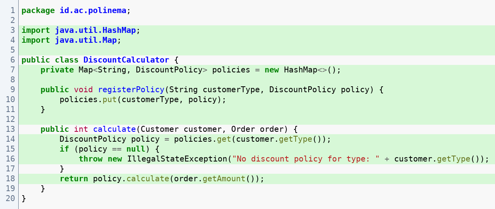{width=70%}

Add a `getDiscountCalculator()` method to `OrderProcessor.java`:

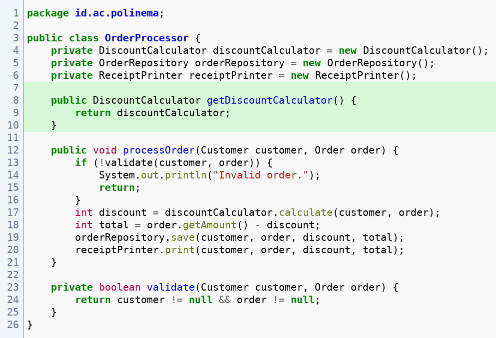{width=80%}

Update `Main.java` to register the discount policies:

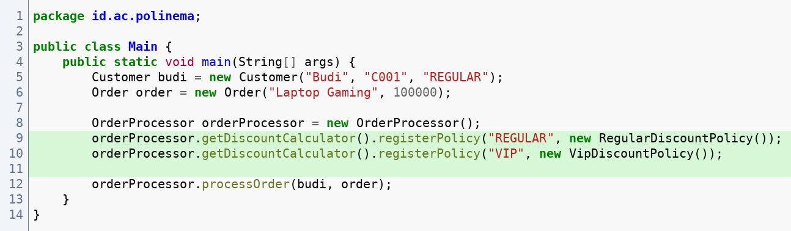{width=65%}

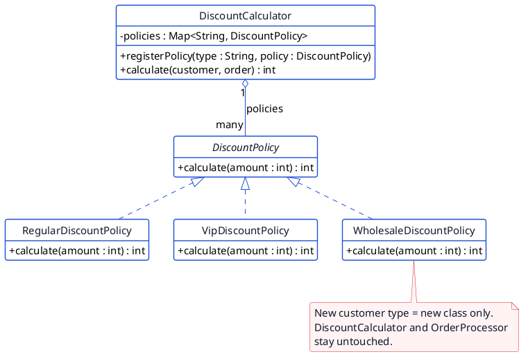{width=75%}

> ✅ **Checkpoint:** the output for Budi is still `Discount : Rp5000`. There's no more stacked `if/else` by customer type inside `DiscountCalculator`.

### Step 5: Prove OCP, add `WholesaleDiscountPolicy` without touching old code

Here's the real proof of OCP: adding a new customer type ("WHOLESALE") only needs one new class and one registration line, without touching `DiscountCalculator.java` or `OrderProcessor.java` at all.

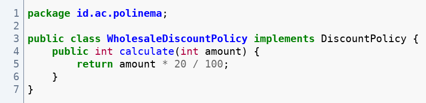{width=45%}

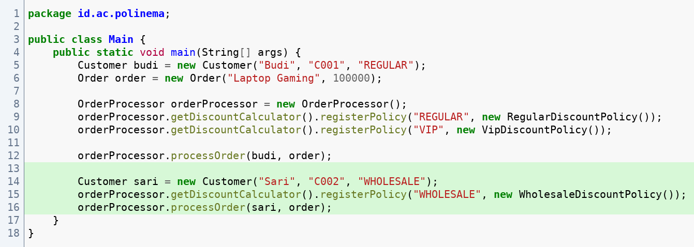{width=70%}

> ✅ **Checkpoint:** the program prints an extra receipt for Sari with `Discount : Rp20000` (20% of Rp100000). Check for yourself: which files did you actually change? Just `WholesaleDiscountPolicy.java` (new) and `Main.java`. `DiscountCalculator.java` and `OrderProcessor.java` are completely untouched, that's OCP.

### Step 6: LSP, reproduce the bug first, then fix it with `Shippable`

The **Liskov Substitution Principle (LSP)** says a subclass has to be able to stand in for its superclass without catching the code that uses it off guard. Add a `ship()` method to `Order.java`, then create `DigitalOrder` to represent a digital-goods order that genuinely can't be shipped by courier:

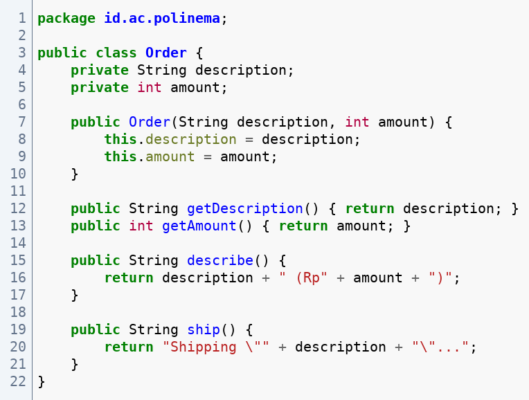{width=55%}

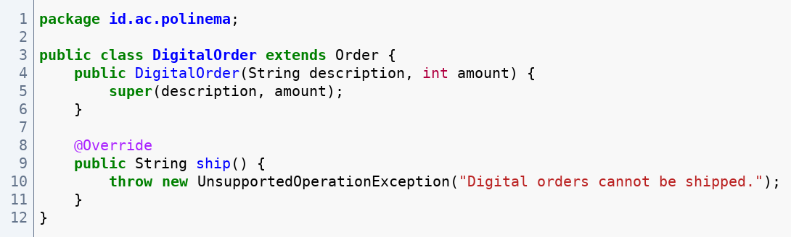{width=55%}

Create a separate test class `ShippingDemo` to reproduce the bug:

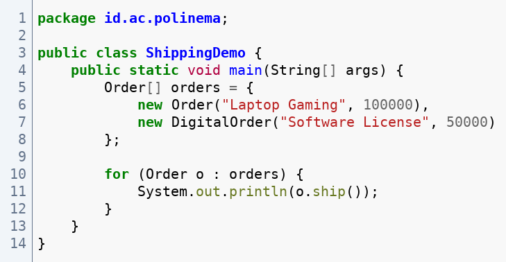{width=55%}

Run `ShippingDemo` (in NetBeans: right-click the file > Run File; without NetBeans: `mvn -q compile exec:java -Dexec.mainClass=id.ac.polinema.ShippingDemo`).

> ✅ **Checkpoint (bug reproduction):** the program CRASHES with `UnsupportedOperationException` as soon as it reaches `DigitalOrder`. This is intentional: `DigitalOrder` looks just like a regular `Order` (it compiles without a single complaint), but the moment it's used inside a loop that calls `ship()` on every element, it catches you off guard. That's the LSP violation right there.

Now let's fix it. Remove the `ship()` method from `Order.java`, create the interface `Shippable`, and create `PhysicalOrder` for orders that genuinely can be shipped:

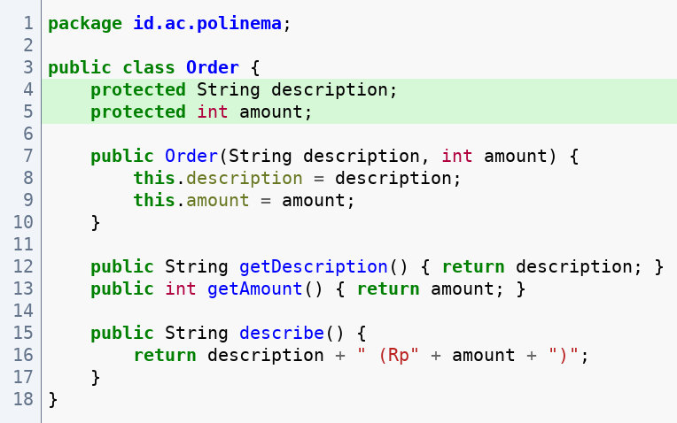{width=55%}

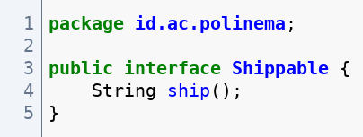{width=45%}

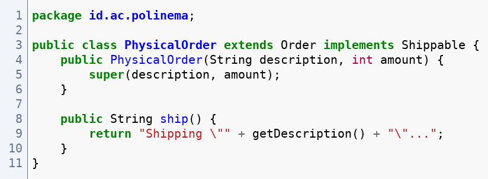{width=55%}

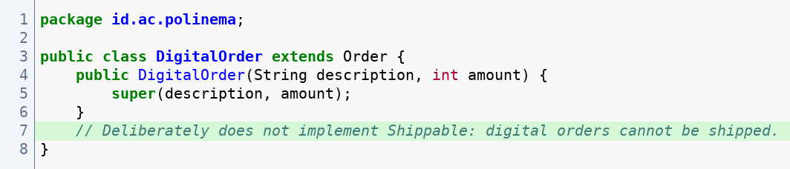{width=55%}

Update `ShippingDemo.java` to check the capability through the interface, instead of assuming every `Order` can be shipped:

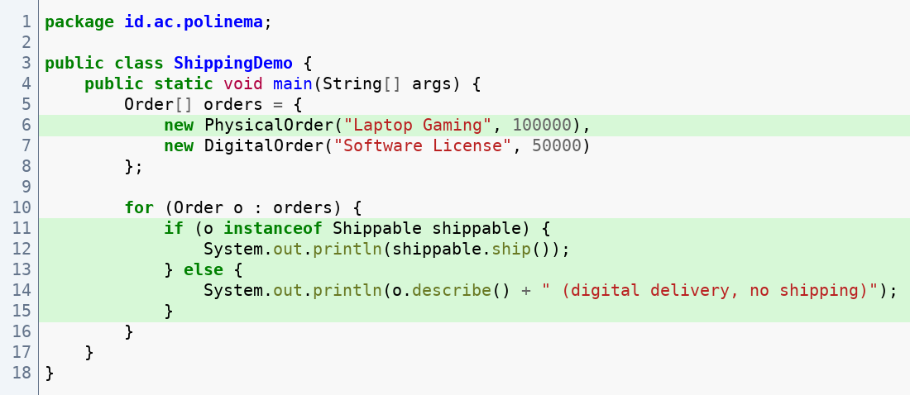{width=55%}

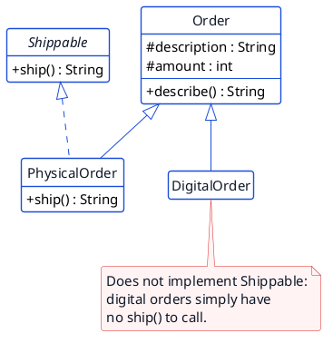{width=60%}

> ✅ **Checkpoint (fix):** recompile and run `ShippingDemo` again. Now the loop finishes without crashing: the first line says it's being shipped, the second says it's digital delivery only.

> ⚠️ **If it fails:** if `Main.java`, which you've been using for the `OrderProcessor` demo in earlier steps, also throws errors, don't worry, that's expected and easy to fix, `Order` still has a public constructor and a `describe()` method, so `Main.java` from Step 5 stays compatible without any changes needed.

> **Note:** here's a genuinely useful rule of thumb: if you find a subclass overriding its parent's method just to throw `UnsupportedOperationException`, that's a strong sign of an LSP violation, that subclass isn't really the "same kind of thing" as its parent.

### Step 7: ISP, break up the fat `OrderNotifier` interface

Given the following interface describing "how to notify a customer" in general, and one implementation for a receipt printer:

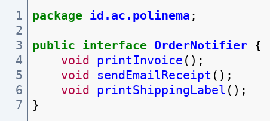{width=55%}

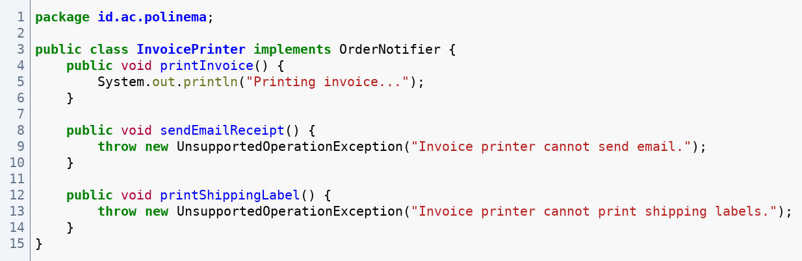{width=55%}

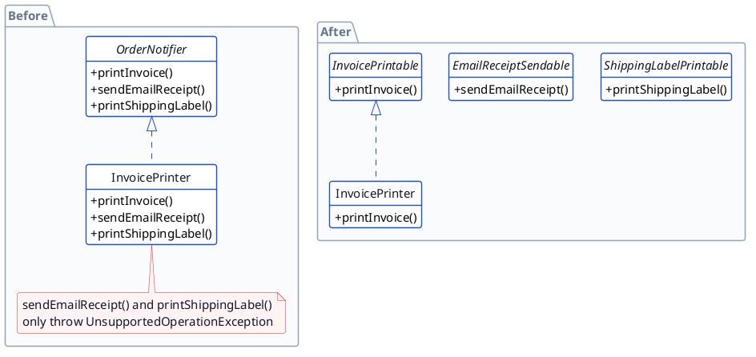{width=85%}

Look at that, `InvoicePrinter` is forced to implement `sendEmailReceipt()` and `printShippingLabel()`, even though a receipt printer never actually does either of those things. This is an **Interface Segregation Principle (ISP)** violation: the interface is too fat, so classes end up forced to implement methods that have nothing to do with them.

Fix it by splitting `OrderNotifier` into three small interfaces. Remove `OrderNotifier.java`, and create these three interfaces:

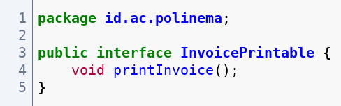{width=45%}

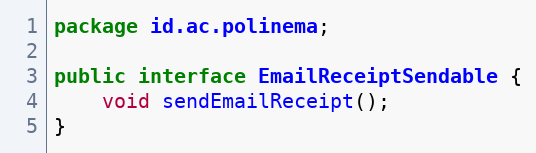{width=45%}

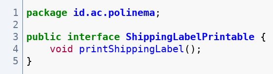{width=45%}

Update `InvoicePrinter.java`:

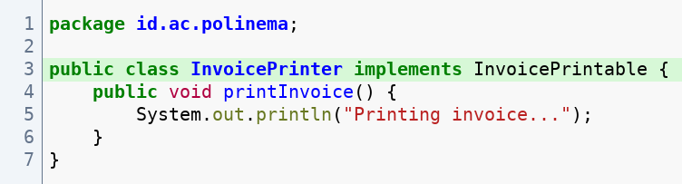{width=55%}

> ✅ **Checkpoint:** `InvoicePrinter` now implements just one method, and it's the method it actually uses. No more methods that only throw `UnsupportedOperationException` because they were "forced along for the ride" by the interface.

> **Note:** you could call ISP the SRP of interfaces, one interface should represent one single capability, not a bundle of capabilities that just happen to often get used together.

### Step 8: DIP, turn `OrderRepository` into an interface

The **Dependency Inversion Principle (DIP)** says a high-level class (`OrderProcessor`) should depend on an abstraction, not on a concrete implementation detail. Right now `OrderProcessor` creates its own `new OrderRepository()` inside its field, which means it's tightly bound to one specific storage method (a text file). If you ever want to swap the storage method, or test `OrderProcessor` without touching a file at all, you're stuck.

Turn `OrderRepository.java` into an interface:

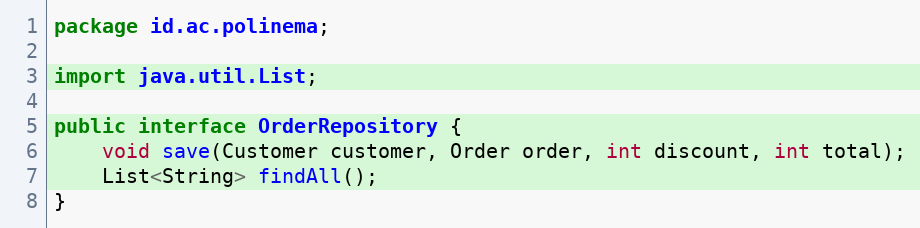{width=60%}

Create `FileOrderRepository` (the old implementation, moved here) and `InMemoryOrderRepository` (a new implementation, handy for quick testing without touching any file at all):

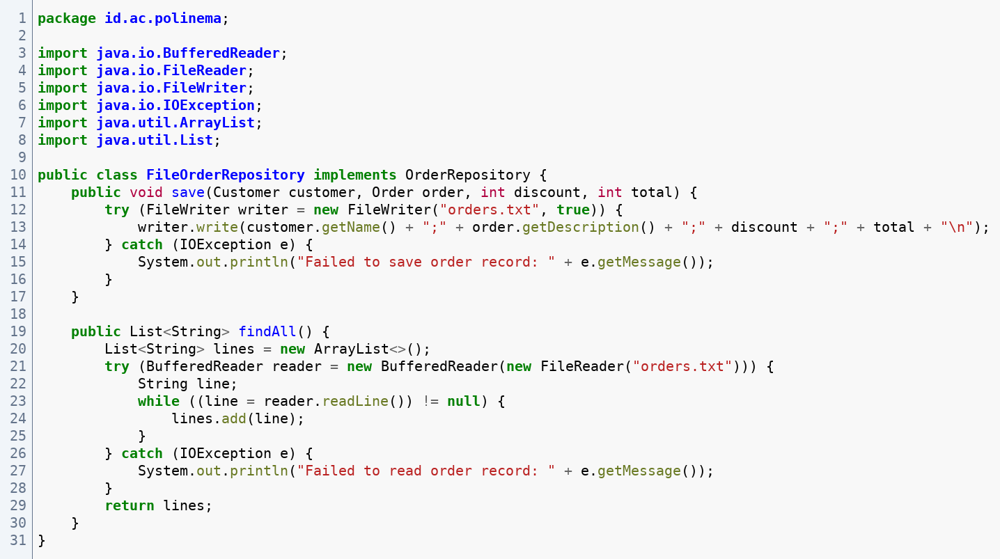{width=70%}

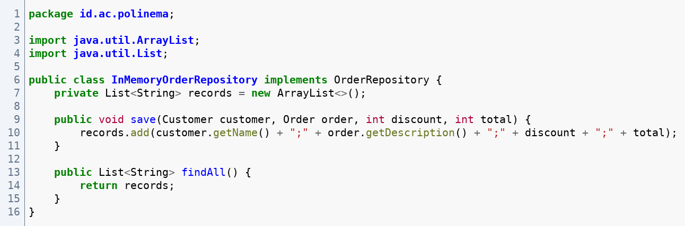{width=70%}

Update `OrderProcessor.java` so all its collaborators come in through the constructor (**constructor injection**), instead of being created internally:

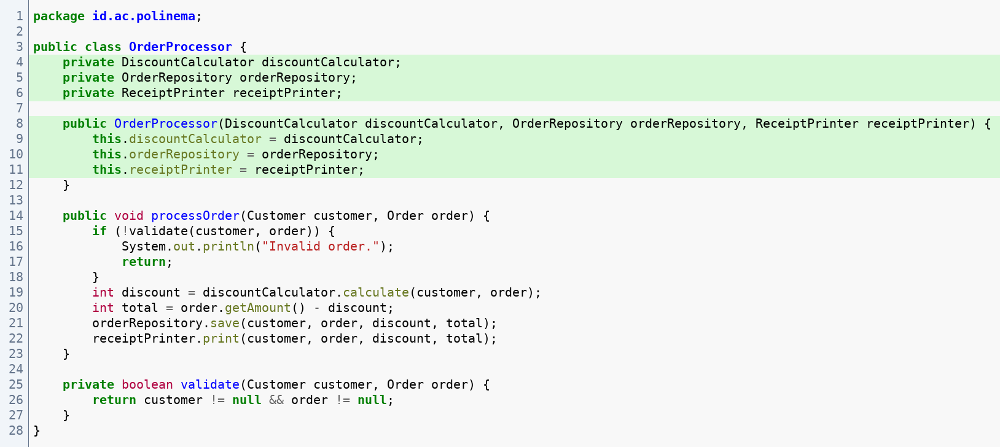{width=80%}

Update `Main.java` to assemble the dependencies and inject them through the constructor:

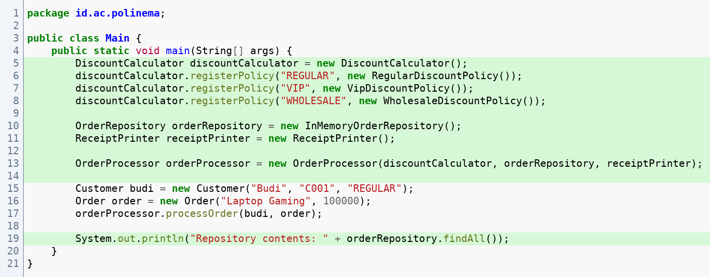{width=70%}

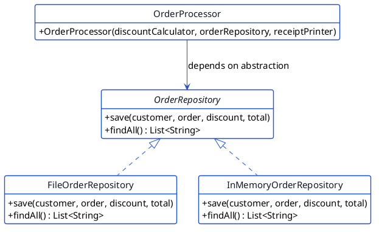{width=70%}

> ✅ **Checkpoint:** the output for Budi is still `Discount : Rp5000`, plus one extra line, `Repository contents: [...]`, showing the stored data without touching the `orders.txt` file at all. Just for fun, try swapping the line `new InMemoryOrderRepository()` for `new FileOrderRepository()`, recompile, run it again: only ONE line changes in the entire project to switch the storage method.

> ⚠️ **If it fails:** if `constructor OrderProcessor in class OrderProcessor cannot be applied to given types` shows up, check the argument order in `new OrderProcessor(...)`, it has to be exactly `discountCalculator, orderRepository, receiptPrinter`.

The following diagram sums up the whole project after all five principles have been applied:

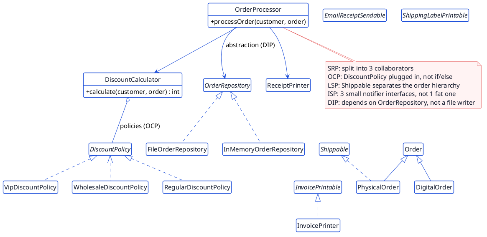{width=95%}

## D. Assignment and Deliverables

Submit the following in the format requested by your instructor:

- Screenshot of `Main.java`'s output after Step 8 (including the "Repository contents" line).
- Screenshot proving the crash in Step 6 before the fix (LSP bug reproduction), and the output after the fix.
- **Independent assignment:** by the end of Step 8, the `OrderProcessor` class still holds onto one extra responsibility beyond orchestration, the `validate(Customer, Order)` method. This is a small SRP violation left in on purpose. Extract that method into its own `OrderValidator` class (with a public method, for example `isValid(Customer, Order)`), wire it in through constructor injection just like the other collaborators, then write 3-5 sentences explaining which SOLID principle you applied and why this change makes `OrderProcessor` easier to test in isolation.

## E. Grading Criteria

| Component | Weight | Full Criteria (100%) | Minimum Criteria |
|---|---:|---|---|
| Work steps completed | 40% | All steps carried out and working | Most steps completed, final result runs |
| Checkpoints verified | 35% | All checkpoints reached and proven (screenshot/output), including the LSP bug reproduction | Some checkpoints proven |
| Independent assignment | 25% | `OrderValidator` correct and SOLID principle justification accurate | Refactoring present even if the explanation is incomplete |
