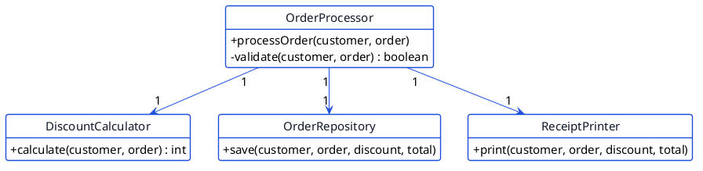

<!-- _class: lead -->

# Pemrograman Berbasis Objek
## RTI253007 &nbsp;|&nbsp; D-IV Teknik Informatika

Pertemuan 11: **SOLID Principles**

Lima prinsip biar rancangan kelasmu tahan banting menghadapi perubahan

---

## Yang Akan Kamu Pelajari

- Kenapa rancangan kelas bisa "membusuk" seiring waktu
- Lima prinsip SOLID: SRP, OCP, LSP, ISP, DIP
- Satu studi kasus yang sama, direfaktor tahap demi tahap

<div class="term-box">
<b>Prasyarat:</b> materi hari ini memakai inheritance, kelas abstrak, interface, dan polymorfisme yang udah kamu pelajari di pertemuan-pertemuan sebelumnya. SOLID bukan konsep baru, ini cara memakai alat-alat itu dengan lebih disiplin.
</div>

---

<!-- _class: divider -->

# Bagian 1
## Mengapa Rancangan Bisa Membusuk

---

## Tiga Gejala Rancangan yang Buruk

<div class="warn-box">
<b>Rigidity (kaku):</b> satu perubahan kecil memaksa kamu mengedit banyak kelas yang sebenarnya nggak berhubungan.
</div>

<div class="warn-box">
<b>Fragility (rapuh):</b> ubah satu bagian kode, eh bagian lain yang kelihatannya nggak berkaitan malah ikut rusak.
</div>

<div class="warn-box">
<b>Immobility (susah dipakai ulang):</b> sebuah kelas terlalu terikat sama konteksnya, jadi susah dipakai di tempat lain.
</div>

---

## Studi Kasus: `OrderProcessor` yang Sudah Membengkak

Bayangkan sebuah aplikasi pemrosesan pesanan yang sudah berjalan cukup lama. Satu kelas, `OrderProcessor`, sekarang menangani semua hal terkait pesanan sekaligus.


---

## Lima Prinsip SOLID

<table class="small">
<tr><th>Huruf</th><th>Nama</th><th>Inti</th></tr>
<tr><td>S</td><td>Single Responsibility</td><td>Satu kelas, satu alasan untuk berubah</td></tr>
<tr><td>O</td><td>Open/Closed</td><td>Terbuka untuk ekstensi, tertutup untuk modifikasi</td></tr>
<tr><td>L</td><td>Liskov Substitution</td><td>Subclass harus bisa menggantikan superclass-nya</td></tr>
<tr><td>I</td><td>Interface Segregation</td><td>Interface kecil dan spesifik, bukan satu interface besar</td></tr>
<tr><td>D</td><td>Dependency Inversion</td><td>Bergantung pada abstraksi, bukan detail konkret</td></tr>
</table>

Sepanjang slide ini, kita perbaiki `OrderProcessor` satu prinsip demi satu prinsip. Kode lengkapnya ada di jobsheet.

---

<!-- _class: divider -->

# Bagian 2
## SRP: Single Responsibility Principle

---

## "Satu Alasan untuk Berubah"

<div class="term-box">
Sebuah kelas sebaiknya cuma punya SATU alasan untuk berubah. Kalau kamu bisa membayangkan lebih dari satu kelompok kebutuhan yang beda-beda, yang masing-masing bisa memicu perubahan kelas ini, itu tandanya SRP dilanggar.
</div>

`OrderProcessor` versi awal berubah kalau aturan diskon berubah, atau kalau cara penyimpanan berubah, atau kalau format struknya berubah. Tiga alasan berbeda, tapi ditumpuk jadi satu kelas.

<div class="tip-box">
Heuristik cepat: coba deskripsikan tugas kelasnya dalam satu kalimat. Kalau butuh kata "dan" untuk menyambung dua tugas berbeda, curigai SRP.
</div>

---

## Sesudah: Dipecah per Tanggung Jawab



`OrderProcessor` sekarang cuma mengorkestrasi `DiscountCalculator`, `OrderRepository`, dan `ReceiptPrinter`, dia sendiri nggak perlu lagi tahu detail perhitungan, penyimpanan, atau formatnya masing-masing.

---

<!-- _class: divider -->

# Bagian 3
## OCP: Open/Closed Principle

---

## "Terbuka untuk Ekstensi, Tertutup untuk Modifikasi"

<div class="term-box">
Kalau ada kebutuhan baru, idealnya kamu cukup MENAMBAH kode baru, bukan MENGEDIT kode lama yang udah teruji.
</div>

```java
if (customer.getType().equals("REGULAR")) { ... }
else if (customer.getType().equals("VIP")) { ... }
else { ... }
```

<div class="warn-box">
Tiap ada tipe customer baru, kamu terpaksa buka lagi method ini dan nambah cabang <code>else if</code>. Kode lama yang udah jalan ikut tersentuh, dan itu selalu berisiko bikin sesuatu yang lain jadi rusak.
</div>

---

## Sesudah: Strategi lewat Interface


<div class="tip-box">
Nambah tipe customer baru cuma butuh SATU kelas baru yang mengimplementasikan <code>DiscountPolicy</code>, plus satu baris pendaftaran. <code>DiscountCalculator</code> dan <code>OrderProcessor</code> sama sekali nggak perlu disentuh.
</div>

---

<!-- _class: divider -->

# Bagian 4
## LSP: Liskov Substitution Principle

---

## "Subclass Harus Bisa Menggantikan Superclass-nya"

<div class="term-box">
Kode yang memakai objek bertipe <code>Order</code> seharusnya tetap bekerja benar, walau objek yang sebenarnya diberikan adalah instance subclass <code>Order</code> apa pun.
</div>

```java
for (Order o : orders) {
    System.out.println(o.ship());   // meledak di DigitalOrder!
}
```

<div class="warn-box">
Kode yang manggil ini memperlakukan semua <code>Order</code> sama (langsung manggil <code>ship()</code>), tapi <code>DigitalOrder</code> bikin kaget dengan <code>UnsupportedOperationException</code>. Substitusinya gagal, ini pelanggaran LSP.
</div>

---

## Sesudah: Pisahkan Kemampuan lewat Interface


<div class="tip-box">
Aturan praktis: kalau ada subclass yang meng-override method cuma buat melempar <code>UnsupportedOperationException</code>, curigai LSP.
</div>

---

<!-- _class: divider -->

# Bagian 5
## ISP: Interface Segregation Principle

---

## "Interface Kecil, Bukan Interface Gemuk"


<div class="tip-box">
ISP bisa dibilang SRP-nya interface: satu interface, satu kemampuan. <code>InvoicePrinter</code> nggak lagi dipaksa mengimplementasikan method yang nggak relevan buatnya.
</div>

---

<!-- _class: divider -->

# Bagian 6
## DIP: Dependency Inversion Principle

---

## "Bergantung pada Abstraksi, Bukan Detail"

```java
private OrderRepository orderRepository = new OrderRepository();
```

<div class="warn-box">
<code>OrderProcessor</code> (kelas tingkat tinggi, isinya logika bisnis) langsung bergantung pada detail implementasi yang konkret (cara nulis ke berkas). Begitu cara penyimpanannya mau diganti, atau kamu mau menguji <code>OrderProcessor</code> tanpa nyentuh berkas sama sekali, kamu jadi terjebak.
</div>

---

## Sesudah: Bergantung pada Interface, Disuntik lewat Constructor


<div class="tip-box">
Ganti <code>FileOrderRepository</code> jadi <code>InMemoryOrderRepository</code>? Cukup ubah SATU baris di <code>Main</code>. <code>OrderProcessor</code> nggak perlu tahu implementasi mana yang dipakai, dia cuma bergantung pada interface <code>OrderRepository</code> (constructor injection).
</div>

---

## Rekap: Satu Proyek, Lima Prinsip


Satu studi kasus, lima prinsip, dan semuanya saling melengkapi.

---

<!-- _class: lead -->

# Referensi & Diskusi

Robert C. Martin, *Agile Software Development: Principles, Patterns, and Practices*

Robert C. Martin, *Clean Architecture*

Jobsheet Praktikum Pertemuan 11 tersedia di `jobsheets/id/pertemuan-11-solid-principles.md`

Diskusi: prinsip SOLID mana yang paling sering kamu langgar tanpa sadar di kode UTS-mu?
