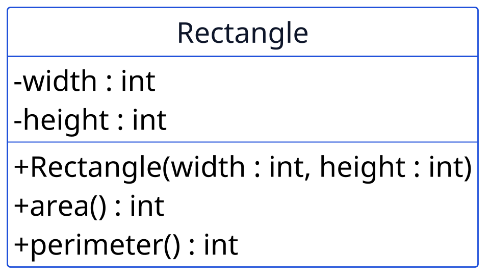
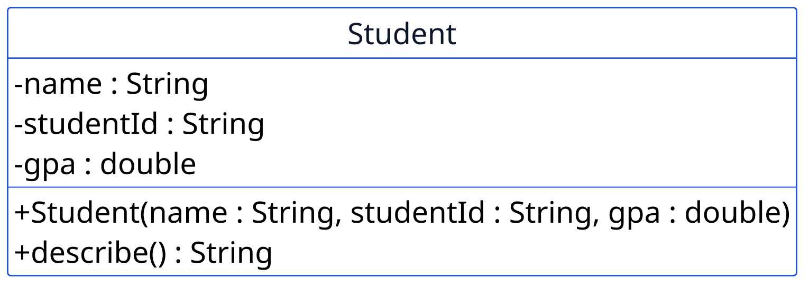

Diberi kode berikut:

```java
Wallet a = new Wallet(1000);
Wallet b = new Wallet(1000);
Wallet c = a;

System.out.println(a == b);
System.out.println(a == c);
```

Apa yang tercetak pada baris pertama dan kedua?
%%%
---
id: m2-03
meeting: 2
format: code
difficulty: hard
points: 8
answer: "Ya, berhasil dikompilasi (null adalah nilai valid untuk tipe referensi apa pun); saat dijalankan, melempar NullPointerException karena tidak ada objek sungguhan di s untuk dipanggil getName()-nya"
explanation: >-
  Compiler hanya memeriksa bahwa `s` bertipe `Student`, dan `null`
  adalah nilai valid untuk tipe apa pun, jadi kompilasi lolos. Masalahnya
  baru muncul SAAT DIJALANKAN: memanggil method pada referensi yang
  masih `null` selalu berakibat NullPointerException karena tidak ada
  objek sungguhan yang menjalankan method itu.
---
Diberi kode berikut:

```java
Student s = null;
System.out.println(s.getName());
```

Apakah kode ini berhasil dikompilasi? Apa yang terjadi ketika dijalankan?
%%%
---
id: m2-06
meeting: 2
format: code
difficulty: hard
points: 8
answer: "Tidak, begitu Product punya satu constructor eksplisit, constructor kosong bawaan tidak lagi otomatis tersedia"
explanation: >-
  Java hanya menyediakan constructor tanpa parameter secara otomatis
  selama kelas belum punya constructor eksplisit apa pun. Begitu
  `Product(String name)` ditulis, constructor kosong bawaan itu hilang,
  jadi `new Product()` tidak lagi valid dan gagal dikompilasi.
---
Kelas `Product` awalnya seperti ini:

```java
public class Product {
    private String name;
}
```

lalu diubah menjadi:

```java
public class Product {
    private String name;

    public Product(String name) {
        this.name = name;
    }
}
```

Setelah perubahan ini, apakah `new Product()` (tanpa argumen) masih berhasil dikompilasi?
%%%
---
id: m2-13
meeting: 2
format: uml
difficulty: hard
points: 10
answer: "(1) Tidak, width dan height ditandai - (private), tidak bisa diakses langsung dari luar kelas. (2) perimeter() mengembalikan int"
explanation: >-
  Tanda `-` di depan `width` dan `height` berarti private, jadi kode di
  luar kelas `Rectangle` tidak bisa membacanya lewat `r.width`, hanya
  lewat method yang disediakan. Tanda tangan `+perimeter() : int` di
  diagram menunjukkan method itu mengembalikan nilai bertipe `int`.
---


Berdasarkan diagram ini saja, jawab dua hal: (1) bisakah kode di luar kelas `Rectangle` membaca `width` secara langsung lewat `r.width`? (2) apa tipe data yang dikembalikan oleh method `perimeter()`?
%%%
---
id: m2-09
meeting: 2
format: uml
difficulty: hard
points: 8
answer: "3 parameter (name, studentId, gpa); gpa tidak bisa diubah langsung dari luar setelah objek dibuat, karena tidak ada setter untuk gpa di diagram ini"
explanation: >-
  Constructor `+Student(name : String, studentId : String, gpa : double)`
  menerima 3 parameter. Karena `gpa` ditandai `-` (private) dan diagram
  ini tidak menampilkan setter untuk `gpa`, nilainya tidak bisa diubah
  langsung dari luar setelah objek terbentuk.
---


Berdasarkan diagram ini, berapa parameter yang diterima constructor `Student`, dan bisakah `gpa` diubah langsung dari luar kelas setelah objeknya dibuat?
%%%
---
id: m2-11
meeting: 2
format: code
difficulty: hard
points: 8
answer: "20"
explanation: >-
  `Rectangle q = p;` tidak membuat objek baru, hanya menyalin referensinya.
  `p` dan `q` menunjuk ke objek yang sama persis, jadi `q.height = 20;` juga
  terlihat lewat `p.height`.
---
Diberi kode berikut:

```java
Rectangle p = new Rectangle(5, 8);
Rectangle q = p;
q.height = 20;
System.out.println(p.height);
```

Apa yang tercetak?
