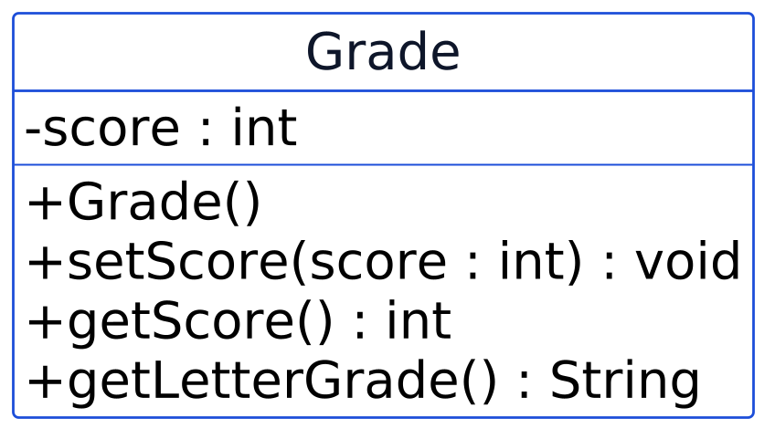

Diberi kelas berikut:

```java
public class Grade {
    private int score;
}
```

dan kode di luar kelasnya:

```java
Grade g = new Grade();
System.out.println(g.score);
```

Apakah baris `System.out.println(g.score);` berhasil dikompilasi?
%%%
---
id: m3-03
meeting: 3
format: code
difficulty: hard
points: 8
answer: "50"
explanation: >-
  `g.setScore(50)` valid dan tersimpan. `g.setScore(150)` ditolak karena
  di luar rentang 0-100 (method langsung `return` tanpa mengubah apa
  pun), jadi `score` tetap di nilai sebelumnya, 50.
---
Diberi kode berikut:

```java
public void setScore(int score) {
    if (score < 0 || score > 100) {
        return;
    }
    this.score = score;
}
```

```java
Grade g = new Grade();
g.setScore(50);
g.setScore(150);
System.out.println(g.getScore());
```

Apa yang tercetak?
%%%
---
id: m3-06
meeting: 3
format: uml
difficulty: medium
points: 5
answer: "Tidak, tidak ada getter atau setter yang ditampilkan sama sekali untuk gpa; kode luar tidak bisa membacanya, bahkan sekadar untuk menampilkan"
explanation: >-
  Diagram hanya menampilkan constructor dan `describe()`, tidak ada
  `getGpa()` atau `setGpa()` sama sekali. Tanpa getter, kode di luar
  kelas tidak punya jalan untuk membaca `gpa`, apalagi mengubahnya.
---


Berdasarkan diagram ini, adakah cara bagi kode di luar kelas `Student` untuk membaca nilai `gpa` secara langsung?
%%%
---
id: m3-13
meeting: 3
format: uml
difficulty: hard
points: 10
answer: "(1) Ya, satu-satunya constructor adalah Grade() tanpa parameter, tidak ada cara membuat objek Grade dengan skor awal langsung dari constructor. (2) Tidak bisa dipastikan hanya dari diagram; diagram UML hanya menunjukkan tanda tangan method setScore(), bukan isi validasinya, jadi perlu membaca kode sumbernya untuk memastikan"
explanation: >-
  Diagram kelas hanya menampilkan nama method, parameter, dan tipe
  kembaliannya, bukan isi/logika di dalamnya. Karena satu-satunya
  constructor yang tampak adalah `+Grade()` tanpa parameter, skor awal
  memang harus diisi belakangan lewat `setScore()`. Tapi apakah
  `setScore()` benar-benar menolak nilai di luar 0-100 tidak bisa
  dipastikan dari diagram, hanya dari isi kodenya.
---


Diagram ini hanya menunjukkan constructor `+Grade()` tanpa parameter dan method `+setScore(score : int) : void` tanpa detail isi kodenya. Berdasarkan diagram ini SAJA, jawab dua hal: (1) apakah objek `Grade` selalu dibuat tanpa skor awal, baru bisa diisi belakangan lewat `setScore()`? (2) bisakah kamu memastikan HANYA dari diagram ini bahwa `setScore()` benar-benar menolak nilai di luar rentang 0-100?
%%%
---
id: m3-10
meeting: 3
format: code
difficulty: medium
points: 5
answer: "Tidak, setter ini menyalin nilai apa pun tanpa memeriksa rentangnya"
explanation: >-
  Setter ini menyalin nilai apa pun ke `score` tanpa pengecekan rentang
  sama sekali, jadi efeknya sama persis dengan atribut public: bisa diisi
  nilai berapa pun, termasuk yang tidak masuk akal.
---
Diberi kode berikut, apakah setter ini melindungi invariant "skor harus 0-100"?

```java
public void setScore(int score) {
    this.score = score;
}
```
%%%
---
id: m3-12
meeting: 3
format: code
difficulty: hard
points: 8
answer: |-
  false, false, true
explanation: >-
  Saldo awal 100000. `spend(150000)` gagal (false) karena melebihi
  saldo. `spend(-5000)` gagal (false) karena jumlahnya tidak positif.
  `spend(50000)` berhasil (true) karena valid dan tidak melebihi saldo.
---
Sebuah `Wallet` punya saldo awal 100000 dan method:

```java
public boolean spend(double amount) {
    if (amount <= 0 || amount > balance) {
        return false;
    }
    balance -= amount;
    return true;
}
```

Apa hasil (return value) dari `spend(150000)`, lalu `spend(-5000)`, lalu `spend(50000)`, dipanggil berurutan?
