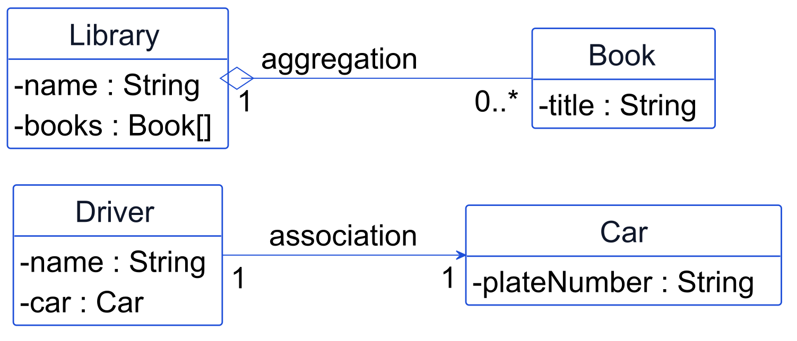
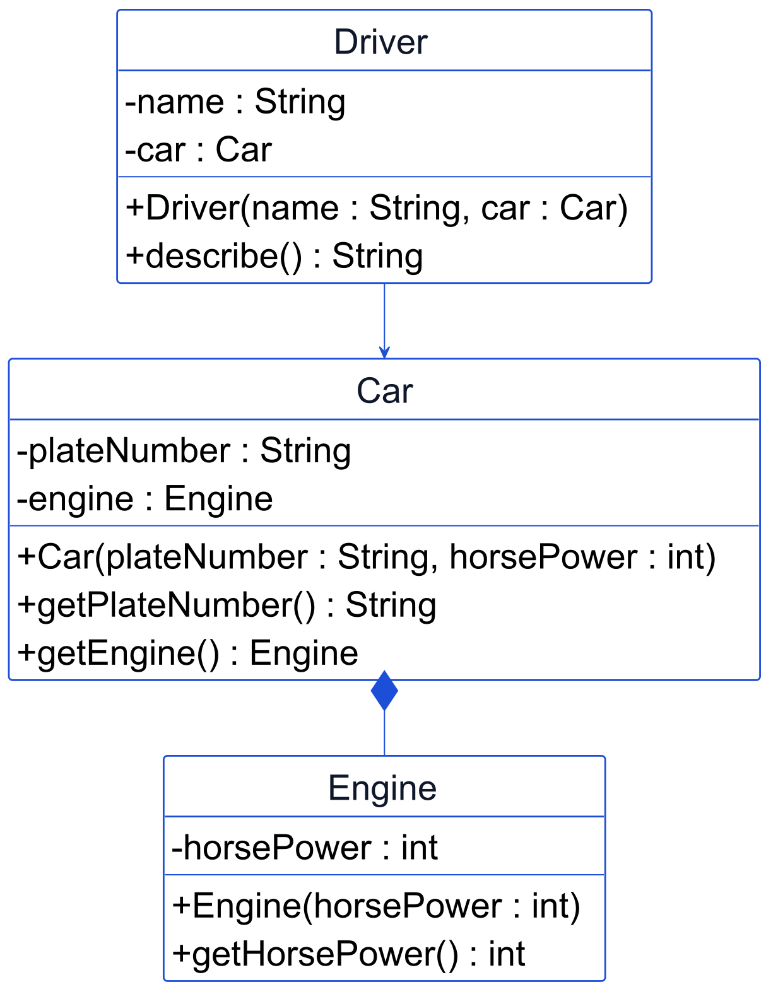

Diberi constructor berikut:

```java
public class Car {
    private Engine engine;

    public Car(int horsePower) {
        this.engine = new Engine(horsePower);
    }
}
```

Berdasarkan kode ini, bisakah dua objek `Car` yang berbeda berbagi (menunjuk ke) satu objek `Engine` yang sama persis?
%%%
---
id: m4-02
meeting: 4
format: code
difficulty: hard
points: 8
answer: "Ya, karena d masih menunjuk ke objek Department yang sama; objek itu tidak bergantung pada variabel e atau objek Employee mana pun"
explanation: >-
  `e = null;` hanya membuat variabel `e` berhenti menunjuk ke objek
  `Employee`-nya. Variabel `d` adalah referensi terpisah yang tetap
  menunjuk ke objek `Department` yang sama seperti sebelumnya. Karena
  relasi ini satu arah (`Employee` mengenal `Department`, bukan
  sebaliknya), umur objek `Department` sama sekali tidak bergantung
  pada `Employee` mana pun.
---
Diberi kelas berikut:

```java
public class Employee {
    private Department dept;

    public Employee(Department dept) {
        this.dept = dept;
    }
}
```

Perhatikan bahwa kelas `Department` TIDAK menyimpan referensi balik ke `Employee` mana pun. Diberi kode berikut:

```java
Department d = new Department("IT");
Employee e = new Employee(d);
e = null;
System.out.println(d.getName());
```

Setelah `e = null;`, apakah baris `System.out.println(d.getName());` masih berhasil berjalan?
%%%
---
id: m4-14
meeting: 4
format: uml
difficulty: hard
points: 10
reasoningHint: "Jawaban wajib disertai alasan berdasarkan diagram (bukan hanya kesimpulan akhir) - jawaban tanpa alasan dianggap tidak lengkap."
answer: "(1) 0 sampai banyak (0..*), tidak dibatasi satu. (2) Tidak, multiplicity di sisi Car adalah 1, artinya tepat satu Driver per Car pada relasi ini"
explanation: >-
  Multiplicity di sisi `Book` ditulis `0..*`, artinya satu `Library` bisa
  memiliki nol, satu, atau banyak `Book` sekaligus. Pada relasi
  `Driver`-`Car` yang terpisah, kedua sisi ditandai multiplicity `1`,
  artinya tepat satu `Driver` berpasangan dengan tepat satu `Car`, bukan
  banyak `Driver` untuk satu `Car` yang sama.
---


Berdasarkan angka multiplicity di diagram ini, jawab dua hal: (1) berapa banyak objek `Book` yang bisa dimiliki satu `Library`? (2) bolehkah satu `Car` yang sama dipakai oleh lebih dari satu `Driver` pada saat bersamaan menurut relasi ini?
%%%
---
id: m4-08
meeting: 4
format: uml
difficulty: medium
points: 5
reasoningHint: "Jawaban wajib disertai alasan berdasarkan diagram (bukan hanya kesimpulan akhir) - jawaban tanpa alasan dianggap tidak lengkap."
answer: "Association, karena tidak ada diamond sama sekali di antara Driver dan Car, hanya panah biasa"
explanation: >-
  Garis antara `Driver` dan `Car` pada diagram ini berupa panah biasa,
  tanpa diamond kosong maupun penuh sama sekali. Tidak adanya diamond itu
  sendiri adalah sinyal: relasi ini bukan aggregation atau composition,
  keduanya butuh diamond.
---


Berdasarkan ada tidaknya diamond pada garis yang menghubungkan `Driver` dan `Car` di diagram ini, relasi apa yang paling tepat untuk `Driver`-`Car`?
%%%
---
id: m4-09
meeting: 4
format: uml
difficulty: hard
points: 8
reasoningHint: "Jawaban wajib disertai alasan berdasarkan diagram (bukan hanya kesimpulan akhir) - jawaban tanpa alasan dianggap tidak lengkap."
answer: "Tidak, karena diamond PENUH (composition) menghubungkan Car dan Engine, umur Engine terikat penuh pada Car"
explanation: >-
  Diamond penuh di antara `Car` dan `Engine` menandakan composition:
  `Car` membuat `Engine`-nya sendiri dan tidak pernah membagikannya
  keluar. Begitu objek `Car` dibuang, `Engine` yang jadi bagiannya ikut
  hilang, tidak ada `Engine` yang tetap hidup sendirian.
---


Berdasarkan jenis diamond yang menghubungkan `Car` dan `Engine` pada diagram ini, jika sebuah objek `Car` dibuang, apakah `Engine` miliknya bisa tetap hidup sendirian?
%%%
---
id: m4-15
meeting: 4
format: code
difficulty: hard
points: 10
reasoningHint: "Jawaban wajib disertai alasan berdasarkan kode (bukan hanya kesimpulan akhir) - jawaban tanpa alasan dianggap tidak lengkap."
answer: "(1) null, dan pemanggil wajib memeriksanya sebelum dipakai. (2) Ya, berhasil dikompilasi. (3) Melempar NullPointerException saat found.printInfo() dipanggil, karena found bernilai null"
explanation: >-
  `findProduct` mengembalikan `null` kalau ID produk tidak ditemukan,
  bukan melempar exception, jadi pemanggil wajib memeriksa null sebelum
  memakai hasilnya. Compiler tidak tahu dan tidak peduli apakah "X999"
  akan ditemukan saat program berjalan; secara sintaks kode ini sah, jadi
  berhasil dikompilasi. Masalahnya baru muncul SAAT DIJALANKAN: karena
  tidak ada pengecekan null sama sekali, `found.printInfo()` melempar
  NullPointerException saat `X999` ternyata tidak ditemukan.
---
Diberi method berikut:

```java
public Product findProduct(String productId) {
    for (int i = 0; i < count; i++) {
        if (products[i].getProductId().equals(productId)) {
            return products[i];
        }
    }
    return null;
}
```

Dan baris kode berikut, tanpa pengecekan null sama sekali:

```java
Product found = catalog.findProduct("X999");
found.printInfo();
```

Jawab tiga hal: (1) apa yang dikembalikan `findProduct` kalau `productId` tidak ditemukan? (2) akankah baris `found.printInfo();` berhasil dikompilasi? (3) apa yang terjadi saat dijalankan kalau `X999` ternyata tidak ditemukan?
%%%
---
id: m4-12
meeting: 4
format: code
difficulty: hard
points: 15
twoColumnLayout: true
answer: |-
  B001 - Algoritma - copies: 2
  B002 - Struktur Data - copies: 2
  B002 - Struktur Data - copies: 2
explanation: >-
  b1 diberi 3 salinan lalu borrow(), sehingga copies jadi 2.
  printAllBooks() mencetak b1 lalu b2 sesuai urutan ditambahkan.
  findBook("B002") menemukan b2 dan mencetaknya sekali lagi, sehingga
  baris "B002 - Struktur Data" tercetak dua kali.
---
Diberi kelas `Book`/`Library` berikut, beserta program yang memakainya:

```java
public class Book {
    private String isbn, title;
    private int copies;

    public Book(String isbn, String title,
                int copies) {
        this.isbn = isbn;
        this.title = title;
        this.copies = copies;
    }
    public String getIsbn() {
        return isbn;
    }
    public boolean borrow() {
        if (copies <= 0) return false;
        copies--;
        return true;
    }
    public void printInfo() {
        System.out.println(isbn + " - "
            + title + " - copies: " + copies);
    }
}

public class Library {
    private Book[] books = new Book[10];
    private int count = 0;

    public void addBook(Book b) {
        books[count++] = b;
    }
    public Book findBook(String isbn) {
        for (int i = 0; i < count; i++) {
            if (books[i].getIsbn().equals(isbn)) {
                return books[i];
            }
        }
        return null;
    }
    public void printAllBooks() {
        for (int i = 0; i < count; i++) {
            books[i].printInfo();
        }
    }
}
```

```java
Book b1 = new Book("B001", "Algoritma", 3);
b1.borrow();
Book b2 = new Book("B002", "Struktur Data", 2);

Library lib = new Library();
lib.addBook(b1);
lib.addBook(b2);
lib.printAllBooks();

Book found = lib.findBook("B002");
if (found != null) found.printInfo();
```

Persis apa yang tercetak ke konsol, baris demi baris?
